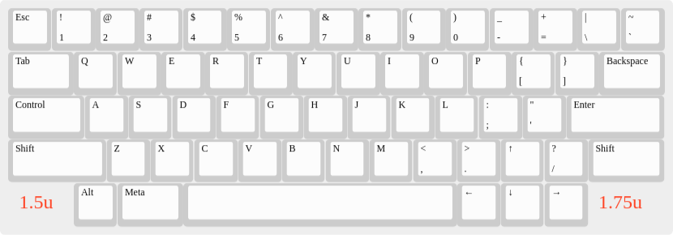
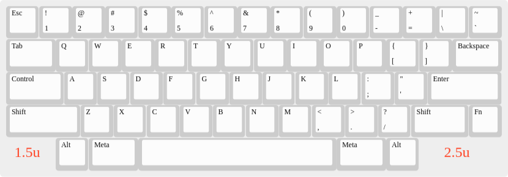

HHKB-style Keyboard Layout Design With Dedicated Cursor Cross
=============================================================

In the ["60% HHKB-like layout, but with dedicated arrows"
thread](https://www.keebtalk.com/t/60-hhkb-like-layout-but-with-dedicated-arrows/8591/5)
on Keebtalk [I posted my take on this
challenge](https://www.keebtalk.com/t/60-hhkb-like-layout-but-with-dedicated-arrows/8591/5)
and since it's an original design of myself, I added it here with a
bit more details in its own category, too.

The Design
----------

### XTHH CC

CC = Cursor Cross (and because I was too lazy counting keys ;-)

[layout as JSON file for the KLE](Layouts/HHKB-cursor-block-layout.json)

#### Comparison with the blocker sizes of the original HHKB

You often read that the original HHKB is all about symmetry. But
actually it's not that symmetrical and my design above is much closer
to something you could call a symmetry, especially if you compare the
blocker sizes:

Similar Keyboards
-----------------

* [YAS62](https://geekhack.org/index.php?topic=87511.0) (Didn't know
  about it when making this design as [I learned about
  it](https://www.keebtalk.com/t/60-hhkb-like-layout-but-with-dedicated-arrows/8591/15)
  in the same thread, just two days after I posted my design there.)
