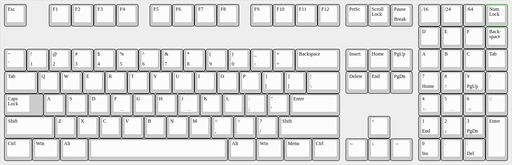
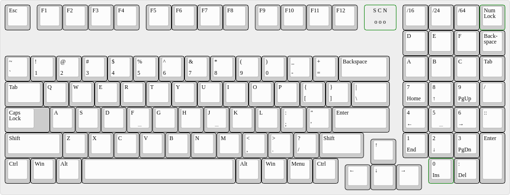

The IPv6 Keyboards
==================

I wondered if the [IPv6Buddy Keypad](https://www.ipv6buddy.com/) could
be integrated as number pad into a full size keyboard.

To not having to add a blocker between the two top most rows I
remembered [Cherry's
1800](https://www.cherry.de/cherry-g80-1800.html) number block
design with an additional row and a full-height blocker row below the
function key row of the full-size keyboard.

Then I noticed that I could just simply take a [Cherry
G80-1800](https://www.cherry.de/cherry-g80-1800.html) (or
[TKC1800](https://thekey.company/collections/tkc-1800)) and just
relabel the number block.

The Designs
-----------

### XTKv6

[layout as JSON file for the KLE](Layouts/xtkv6.json)

Basically a full size keyboard with a IPv6-labelled G80-1800 number
pad.

### XTKv6-1800

[layout as JSON file for the KLE](Layouts/xtkv6-1800.json)

Basically a relabelled [Cherry
G80-1800](https://www.cherry.de/cherry-g80-1800.html) or
[TKC1800](https://thekey.company/collections/tkc-1800).
