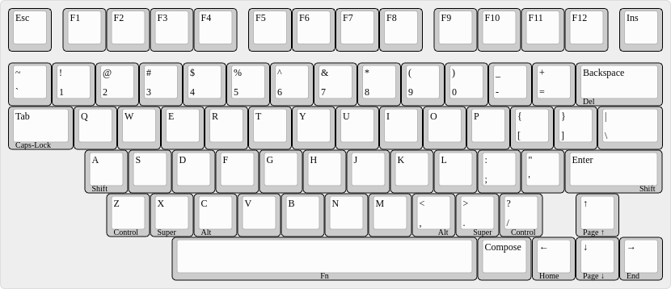

70% Keyboard Layout Design Without Modifiers
============================================

While toying around with 40% and 30% designs, I noticed that I can
easily live without modifier keys and use tap-or-hold on the bottom
row keys (usually the row with `ZXCV`).

But I also noticed that prefer to still have keys for e.g. `;',.-=`,
numbers and actually also function keys. (The number keys correspond
to the virtual desktops 1 to 10 in my [i3
setup](https://github.com/xtaran/ratpoison-desktop) and the functions
keys to the virtual desktops 11 to 22.)

And of course I need a dedicated cursor key cluster, too!

So tried to see how a keyboard layout would look like which
incomproates all those constraints while leaving out those keys I
don't need.

The Design
----------

### XTNM 70

NM = No Mods

[layout as JSON file for the KLE](Layouts/XTNM-70.json)

All keys are standard key sizes and rows except `Ins` which needs a
different key in case the keycap set makes a difference between row 0
and row 1.

Since I always use (at least) the Menu key as Compose key, I labelled
it as such.

#### Usage

##### Using Tap-or-Hold

* `A` and `Enter` are `Shift` on hold
* `Z` and `/` are `Control` on hold
* `X` and `.` are `Super` (Windows/OS keys) on hold
  * Yes, I only need that key as modifier as I don't use Windows.
* `C` and `,` are `Alt` on hold
* `Space` is `Fn` (layer switch) on hold. (That concept is nowadays
  known as [SpaceFn](https://github.com/OhYee/SpaceFn)
  although the [original
  idea](https://geekhack.org/index.php?topic=51069.0) worked a little
  bit different.)

If you need to auto-repeat keys, e.g. `Space`, press it once, release
it, press it immediately again and hold it down. (QMK's so called
tap-dance.)

##### Using Space as layer switch

* The cursor keys are `Home`/`End`, `PageUp`/`PageDown`.
* `Backspace` is `Delete`
* `Tab` is `Caps-Lock` (usually only needed to unfuck weird systems
  and KVM switches)
* `Scroll Lock`, `Pause/Break`, `Print Screen` are undecided yet, but
  I actually don't care. Probably `F10` to `F12` or so.

#### Nicknames

Those names came into my mind first, because they're a pun on used
features

* TableDance70 (because it makes use of QMK features often called "tap dance")
* StripDance70 (dito plus because the stripped modifier keys)

