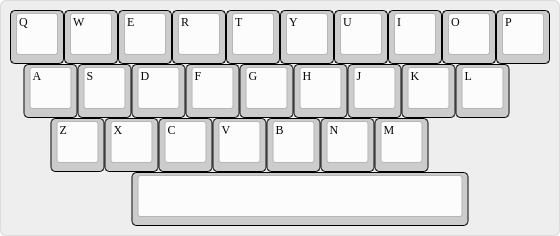
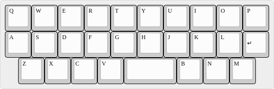
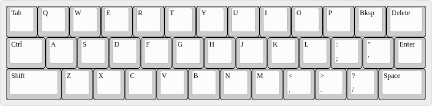
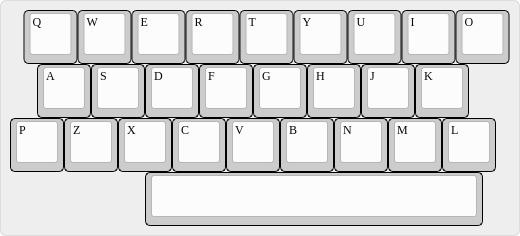
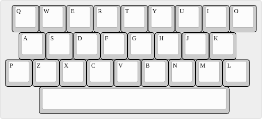
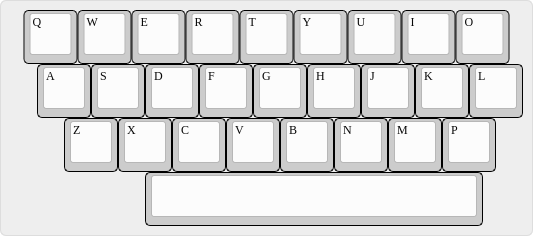
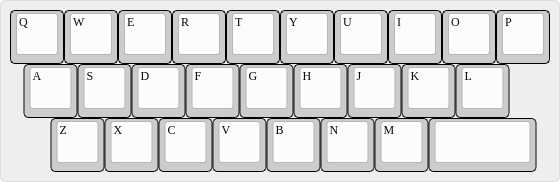
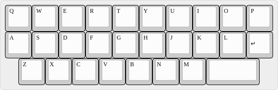

Painigma27 and Friends
======================

A set of minimal 26% (27 keys) keyboard designs inspired by the
[Enigma](https://en.wikipedia.org/wiki/Enigma_machine), the [pain27
keyboard](https://github.com/uuupah/pain27) (licensed under the CC0
license), the [Alpha keyboard](https://github.com/PyrooL/Alpha)
(licensed under the MIT license, and the [30wer
keyboard](https://www.keebtalk.com/t/gb-30wer-by-8o7wer/3618).

The Idea
--------

* Having seen a [real Enigma cryptographic
  machine](https://commons.wikimedia.org/wiki/File:Commercial_ENIGMA_-_National_Cryptologic_Museum_-_DSC07755.JPG)
  in a museum and having noticed its unusual, but very compact "25%"
  layout, I wondered if this could be the base for a very compact
  Sub-30% keyboard.
* The Enigma had no Space, Shift or other keys than letters, but we
  need at least one more key, probably working as SpaceFn.
* The outcome is similar to and probably could also be based upon the
  minimal [pain27 keyboard](https://github.com/uuupah/pain27).

The Idea Providers
------------------

### Enigma Machine

### pain27

### Alpha

### 30wer

The Designs
-----------

(The JSON layout files are meant for usage with the [Keyboard Layout
Editor](http://www.keyboard-layout-editor.com/) and compatible tools.)

### pain27-based

#### Painigma27

The real Enigma keyboard layout plus spacebar based on the pain27

[layout in JSON format](Layouts/painigma27.json)

#### Painigma27.7c

The real Enigma keyboard layout plus a centered 7u spacebar—compared
to the off-center 6.25u spacebar of the pain27.

[layout in JSON format](Layouts/painigma27-7c.json)

#### Halfnigma27

A less awkward deviation from the standard layout by only moving the P
key to where the Enigma moved the L key. Everthing else is again
identical to the pain27.

[layout in JSON format](Layouts/halfnigma27.json)

#### pain27wer

Sparked by the Enigma's usage of the spot right of the M key, this is
a crossover of the pain27 and 30wer keyboards.

[layout in JSON format](Layouts/pain27wer.json)

### Alpha-based

#### Alpahwer

Same idea as with the pain27wer, but based on the Alpha keyboard by
simply moving the B, N, and M keys back to their classic position and
positioning the SpaceFn key right of the M key instead of between the
V and B keys.

[layout in JSON format](Layouts/pain27wer.json)
