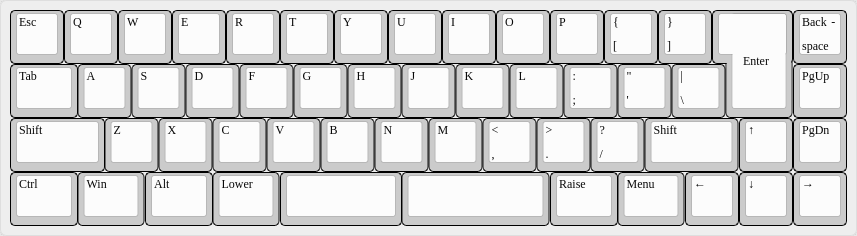

XTK and Friends: 45% to 55% Keyboard Designs
============================================

("XTK" is short for "XTaran's Keyboard(s)")

Incentives
----------

* Four rows of keys only (40% style): R2-R5
* Though all common columns including brackets, single/double quotes,
  backslash/pipe. → more 50% than 40%
* Dedicated arrow keys in turned-over-T layout.
* Either HHKB layout or additional column with
  Home/PageUp/PageDown/End.
* Should probably support both, single or split spacebar.
* Running free software ([QMK](https://qmk.fm/)) as firmware.
* Bezel-less sandwich case design with standoffs between the switches,
  similar to the
  [Zlant](https://www.1upkeyboards.com/shop/keyboard-kits/diy-40-kits/zlant-40-keyboard-kit/)
  ([see the plate and bottom in this
  picture](https://www.1upkeyboards.com/wp-content/uploads/2018/11/Keyboard-Ziptyze-Zlant-01.jpg))
  or the [Candybar
  Standard](https://thekey.company/collections/candybar/products/candybar-standard)
  ([see this
  picture](https://cdn.shopify.com/s/files/1/1679/2319/products/standard.png)).

### Dropped requirements

* [GMK Paperwork](https://thevankeyboards.com/products/paperwork)
  compatibility
    * Misses the bracket and backslash/pipe keys anyway.
    * The HHKB variant (XTHH) comes close, but there's no 2u Shift in
      GMK Paperwork included. Might be compensated with a 1u Shift
      plus another 1u key (as in the XTHH 49 layout).

### Other Ideas

[Sub-30% Keyboards with Enigma Layout](Painigma27.md)

The Designs
-----------

I started with a 60% layout and wanted only four rows like 40%, but
with all columns of a 60% and dedicated cursor keys. The latter caused
the design to gain that additional column typical for 65% keyboards.

### XTK

* 15.5u width (a common 60% has 15u width, a common 65% has 16u width,
  most 40% have between 12u and 13u width)
* 52 to 56 keys (the possible layouts are dubbed XTK 50 to XTK 53
  below)
* All these layouts should be doable with one plate and PCB design.

#### XTK 51

* 53 Keys = 51%

Was the first design I came up with as it's most close to a 65%
design. It has a standard 6.25 spacebar.

(Note: [GMK Nines](https://kono.store/products/gmk-nines-keycap-set)
does not have all these keys.)

#### XTK 53

* 55 Keys = 53%

The same again, just with dedicated Lower and Raise keys and split
space:

#### XTK 50 ISO / XTK 52 ISO

* 52 Keys = 50% (single space)
* 54 Keys = 52% (split space)

XTK 51 and XTK 53 could actually support an ISO Enter key as by
coincidence Backspace and Enter together already have the exact size
of an ISO Enter key. So let's move Backspace to where the Home key was
and offer an ISO Enter, too:

### XTW

* W = wide
* 15.75u width
* So far only one layout (XTW 54). Theoretically there are further
  layout variants possible:
    * It should also be doable with a single spacebar. Haven't
      checked, though.
    * ISO support is theoretically possible, but would need 1.25u
      Home/Backspace and PageUp keys which surely would look rather
      ugly, not to mention that a 1.25u PageUp key cap is rather
      difficult to find.
* Actually a superset of the XTHH/XTHH 48 layout shown (see below) if
  you consider the Ctrl/Win/Alt keys to be rather flexible in width.

#### XTW 54

* 56 Keys = 54%

Having seen [Zambumon’s
Tokyo66](https://zambumon.files.wordpress.com/2018/09/nautilus_nightmares_tokyo66_1.png)
on the [Nautilus
Nightmares](https://zambumon.com/nautilus-nightmares/) page, I
couldn’t stop thinking how an arrow up key (and the according keys
below) between /? and the right Shift key. This though needs 0.25u
wider Backspace and Enter keys and hence a different plate and case.

### XTHH

* HH = Happy Hacking
* 14.75u width
* HHKB-style bottom row with 1u blocks (the possible layouts are
  dubbed XTHH 48 and XTHH 49 below)
* All these layouts should be doable with one plate, case and PCB design.

#### XTHH 48

* 50 Keys = 48%

But actually that arrow keys position works nicer with a HHKB style
setup as the right arrow key is on the edge of the key space, so I
also made a HHKB style design without that additional key column:

#### XTHH 49

* 51 Keys = 49%

And as a variant, here’s also a 1u right Shift plus an additional 1u
key, e.g. a function key like the HHKB, because 2u Shift key caps are
hard to find:

(Note: The colors used in the Laser SA render are just guessed.)

Intended features
-----------------

* [Kailh hotswap
  sockets](https://kbdfans.com/collections/keyboard-part/products/mechanical-keyboard-switches-kailh-pcb-socket)
  with PCB-mount support — if this is ever growing out of the
  handwired state.

Layout Files
------------

All the [JSON files](Layouts/) are made with and meant for the [online
Keyboard Layout Editor](http://www.keyboard-layout-editor.com/). The
images are made with it, too.

To generate the files needed to produce the plates, you might want to
use [Will Steven's Online Plate & Case
Builder](http://builder.swillkb.com/).

[Colored Layouts](Images/) rendered with [KLE
Render](https://kle-render.herokuapp.com/).

Inspirations
------------

### HHKB-style Keyboards With Dedicated Cursor Keys

* [Tokyo66](https://zambumon.files.wordpress.com/2018/09/nautilus_nightmares_tokyo66_1.png)
  (via [Nautilus
  Nightmares](https://zambumon.com/nautilus-nightmares/))

### 40% Keyboards With Dedicated Cursor Keys

* [TheVan Keyboard's MiniVan](https://thevankeyboards.com/pages/minivan)
* [TKC CandyBar](https://thekey.company/collections/candybar) (40%
  plus number block; so a 50% to 55% layout, too, but different
  ideas; ordered one btw. :-)
* [Percebe](https://zambumon.files.wordpress.com/2018/09/nautilus_nightmares_percebe_1.png)
  (via [Nautilus
  Nightmares](https://zambumon.com/nautilus-nightmares/))

### Other 40% Keyboards

* [Zlant](https://www.1upkeyboards.com/shop/keyboard-kits/diy-40-kits/zlant-40-keyboard-kit/)
  (bezel-less design and standoff position)

Similar Keyboards
-----------------

… but not really inspirations.

* [Don Park's Slim 55%
  Layout](https://www.keebtalk.com/t/slim-55-layout/6771) (very
  similar in size, but with different incentives; learned of it only
  after I made my designs initially)
* [DDmicro](https://kbdfans.com/blogs/news/ddmicro-wireless-keyboard)
  (a 40% with potentially dedicated cursor keys, and hence close, but
  without the additional column and unfortunately wireless — and sold
  out; heard and forgot about it before I did my designs and after I
  showed my designs around, someone made me aware of it again.)
* [TMO50](https://geekhack.org/index.php?topic=94675.0) and its
  cheaper 3D-printed clone
  [Nightmare](https://keyhive.xyz/shop/nightmare-pcb-and-case)
* [Magicforce
  49](https://medium.com/@LinkedDesigns/magicforce-49-review-a-budget-40-mechanical-keyboard-52faab6ef10)
* [JD45](https://carpekeyboards.com/reference/jd45/) (a 45%
  with similar layout, just one column less)
* [iso50](https://github.com/trebb/iso50)
* [ai03 Voyager50](https://github.com/ai03-2725/Voyager50) (actually
  just a PCB)

#### HHKB-style 40% Keyboards

Basically any 40% HHKB-style keyboard is similar to the HHKB-variant
of my design.

* [Neuron](https://www.keebtalk.com/t/ic-neuron-hhkb-40/6894)
* [Pearl](https://geekhack.org/index.php?topic=92259.0)
* [Daisy HHKB-variant](https://kprepublic.com/products/anodized-aluminium-case-for-daisy-40-hhkb-layout-custom-keyboard-acrylic-diffuser-can-support-daisy)
* Dimple ([Geekhack](https://geekhack.org/index.php?topic=99501.0), [Website](http://lazydesigners.cn/dimple/))
* [Akihabara 40](https://www.thingiverse.com/thing:3105838)

Resources
----------

### General Keyboard Resources

* [Matt3o's "Book": How to Build a Custom
  Keyboard](https://matt3o.com/book/) (more or less a series of long
  and very informative blog postings under a Creative Commons license)
* The [40percent.club Blog](https://www.40percent.club/)
* [Keebfolio](https://keebfol.io/), a list of open source keyboards,
  tutorials and similar stuff.
* [Open Source Mechanical Keyboards and where to find
  them](https://keyboard.help14.com/)
* [List of PCB Manufacturers and laser cutting
  services](https://github.com/joric/qmk_firmware/wiki/jorne#pcb-manufacturers-and-laser-cutting-services)
  in the wiki of joric's Crkbd/Corne variant called jorne.
* [ai03's PCB Designer
  Guide](https://wiki.ai03.me/books/pcb-design/chapter/pcb-designer-guide)
* [Keyboard PCB
  Guide](https://github.com/ruiqimao/keyboard-pcb-guide/blob/master/README.md)

### Micro Controller

* The [40percent.club Blog](https://www.40percent.club/) about:
    * [Pro Micros](https://www.40percent.club/2018/01/pro-micros.html)
    * [More Pro
      Micros](https://www.40percent.club/2018/10/things-called-pro-micro.html)
    * [Micro Controller
      Sizes](https://www.40percent.club/2016/12/controller-comparison.html)
    * [Micro Controller
      Sockets](https://www.40percent.club/2018/03/sockets.html)
* The [Goldfish](https://github.com/Dr-Derivative/Goldfish), an
  open-source USB-C Pro Micro clone. ([Geekhack
  thread](https://geekhack.org/index.php?topic=93571.0))

#### Where To Buy

* Elite-C: [at CandyKeys](https://candykeys.com/product/elite-c) or
  [at NovelKeys](https://novelkeys.xyz/products/elite-c-pcb-v3)
* PJRC Teensy (multiple variants): [at
  Maker-Shop.ch](https://www.maker-shop.ch/mainboards/teensy/boards),
  [at Pimoroni](https://shop.pimoroni.com/?q=Teensy)
* SparkFun Pro Micro (5V): [at Pimoroni](https://shop.pimoroni.com/products/pro-micro-5v-16mhz)
* Blue Pro Micro clone: [at
  CandyKeys](https://candykeys.com/product/pro-micro-5v-16mhz) or [at
  KeyHive](https://keyhive.xyz/shop/pro-micro)
* [QMK Proton C](https://qmk.fm/proton-c/): [at
  OLKB](https://olkb.com/parts/qmk-proton-c), or [at 1UP
  Keyboards](https://www.1upkeyboards.com/shop/controllers/qmk-proton-c/)
  or [at
  mykeyboard.eu](https://mykeyboard.eu/catalogue/qmk-proton-c-rev-2_1246/)

Thanks
------

* Ermel for helping on my way to find a proper project name. The name
  under which I initially published this, "XTKb", was his idea (though
  with different capitalization) after I wasn't happy that my idea
  "XTK" was already in use quite often. At some point I though decided
  that I'll use "XTK" anyway as "X Tool Kit" is definitely a different
  type of thing, so after a while I switched to this initial idea.
* Stephan for reminding me of the DDmicro.
* Marcel for remembering where I saw that Pro Micro comparison.

Copyright & License
-------------------

These keyboard designs are free software: you can redistribute them
and/or modify them under the terms of the GNU General Public License
as published by the Free Software Foundation, either version 3 of the
License, or (at your option) any later version.

These keyboard designs are distributed in the hope that they will be
useful, but WITHOUT ANY WARRANTY; without even the implied warranty of
MERCHANTABILITY or FITNESS FOR A PARTICULAR PURPOSE.  See the GNU
General Public License for more details.

You should have received a copy of the GNU General Public License
along with these keyboard designs.  If not, see
https://www.gnu.org/licenses/.

TODO
----

Separate the several designs (26% and 50% keyboards) into
subdirectories or their own Git repositories.
