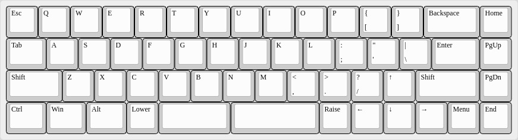

XTKb: 45% to 55% Keyboard Designs
=================================

("XTKb" is short for "XTaran's Keyboards")

Incentives
----------

* Four rows of keys only (40% style): R2-R5
* Though all common columns including brackets, single/double quotes,
  backslash/pipe. → more 50% than 40%
* Dedicated arrow keys in turned-over-T layout.
* Either HHKB layout or additional column with
  Home/PageUp/PageDown/End.
* Should probably support both, single or split spacebar.
* Running free software ([QMK](https://qmk.fm/)) as firmware.

### Dropped requirements

* [GMK Paperwork](https://thevankeyboards.com/products/paperwork)
  compatibility
    * Misses the bracket and backslash/pipe keys anyway.
    * The HHKB variant comes close, but there's no 2u Shift in GMK
      Paperwork included. Might be compensated with a 1u shift plus
      another 1u key.
* ISO support — doesn't really work with Backspace on R2.

The Designs
-----------

I started with a 60% layout and wanted only four rows like 40%, but
with all columns of a 60% and dedicated cursor keys. The latter caused
the design to gain that additional column typical for 65% keyboards.

### XT51

53 Keys = 51%; 15.5u width

Was the first design I came up with as it's most close to a 65%
design. It has a standard 6.25 spacebar.

### XT53

55 Keys = 53%; 15.5u width

The same again, just with dedicated Lower and Raise keys and split
space:

### XT54

56 Keys = 54%; 15.75u width

Having seen [Zambumon’s
Tokyo66](https://zambumon.files.wordpress.com/2018/09/nautilus_nightmares_tokyo66_1.png)
on the [Nautilus
Nightmares](https://zambumon.com/nautilus-nightmares/) page, I
couldn’t stop thinking how an arrow up key (and the according keys
below) between /? and the right Shift key:

### XTHH48

50 Keys = 48%; 14.75u width

But actually that arrow keys position works nicer with a HHKB style
setup as the right arrow key is on the edge of the key space, so I
also made a HHKB style design without that additional key column:

### XTHH49

51 Keys = 49%; 14.75u width

And as a variant, here’s also a 1u right Shift plus an additional 1u
key, e.g. a function key like the HHKB, because 2u Shift key caps are
hard to find:

Intended features
-----------------

* Kailh hotswap sockets with PCB-mount support — if this is every
  growing out of the handwired state.

Layouts
-------

All the JSON files are made with and meant for the [online Keyboard
Layout Editor](http://www.keyboard-layout-editor.com/). The images are
made with it, too.

To generate the files needed to produce the plates, you might want to
use [Will Steven's Online Plate & Case
Builder](http://builder.swillkb.com/).

Inspirations
------------

### HHKB-style Keyboards With Dedicated Cursor Keys

* [Tokyo66](https://zambumon.files.wordpress.com/2018/09/nautilus_nightmares_tokyo66_1.png?w=788&h=525)
  (via [Nautilus
  Nightmares](https://zambumon.com/nautilus-nightmares/))

### 40% Keyboards With Dedicated Cursor Keys

* [TheVan Keyboard's MiniVan](https://thevankeyboards.com/pages/minivan)

Similar Keyboards
-----------------

… but not really inspirations.

* [Don Park's Slim 55%
  Layout](https://www.keebtalk.com/t/slim-55-layout/6771) (very
  similar in size, but with different incentives; learned of it only
  after I made my designs initially)
* [TKC CandyBar](https://thekey.company/collections/candybar) (40%
  plus number block; so a 50% to 55% layout, too, but very different
  ideas; ordered one)
* [DDmicro](https://kbdfans.com/blogs/news/ddmicro-wireless-keyboard)
  (a 40% with potentially dedicated cursor keys, and hence close, but
  without the additional column and unfortunately wireless — and sold
  out; heard and forgot about it before I did my designs and after I
  showed my designs around, someone made me aware of it again.)

#### HHKB-style 40% Keyboards

Basically any 40% HHKB-style keyboard is similar to the HHKB-variant
of my design.

* [Neuron](https://www.keebtalk.com/t/ic-neuron-hhkb-40/6894)
* [Pearl](https://geekhack.org/index.php?topic=92259.0)
* [Daisy HHKB-variant](https://kprepublic.com/products/anodized-aluminium-case-for-daisy-40-hhkb-layout-custom-keyboard-acrylic-diffuser-can-support-daisy)

Thanks
------

* Ermel for the idea of the project name "XTKb".
* Stephan for reminding me of the DDmicro.

Copyright & License
-------------------

These keyboard designs are free software: you can redistribute it
and/or modify it under the terms of the GNU General Public License as
published by the Free Software Foundation, either version 3 of the
License, or (at your option) any later version.

This program is distributed in the hope that it will be useful, but
WITHOUT ANY WARRANTY; without even the implied warranty of
MERCHANTABILITY or FITNESS FOR A PARTICULAR PURPOSE.  See the GNU
General Public License for more details.

You should have received a copy of the GNU General Public License
along with this program.  If not, see https://www.gnu.org/licenses/.
