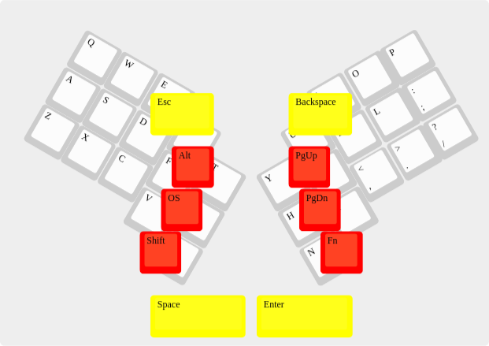

Thumbwing
=========

The Thumbwing is the idea of a mostly thumb-operated mechanical 30%
keyboard which you hold like a gamepad and which has the modifier keys
on the back side as well as some shoulder and belly keys.

The idea came up after holding an
[Alpha28](https://github.com/PyrooL/Alpha) like a gamepad with both
hands and typing with the thumbs.

[layout in JSON format](Layouts/Thumbwing.json)

Red are backside keys, yellow are shoulder and belly keys. The belly
keys are probably mounted in the same plate as the normal keys, just
with keycaps mounted 180° turned, so that they have the surface
showing more towards the belly. The same might work with the shoulder
keys.

The partially covered remainders are the standard columnar staggered
rows 2 to 4 taken from an Atreus (as it was available as preset in
KLE), but with 30° turned instead of just 10°.

The idea is that at least the index fingers are not resting on the
backside but on the keyboard’s shoulders to keep the keyboard from
slipping out of your hands. (I should probably move the shoulder keys
more to the outer edges, my index fingers aren’t that long.)

Backside keys at least should be doable in both, Kailh Choc low
profile switches as well as in classic Cherry MX compatible switches.

The idea of this keyboard came up during the discussion in the
[Concepts for Sub-30% Key and Layer Layouts?](https://www.keebtalk.com/t/concepts-for-sub-30-key-and-layer-layouts/8521/15)
thread on Keebtalk.
