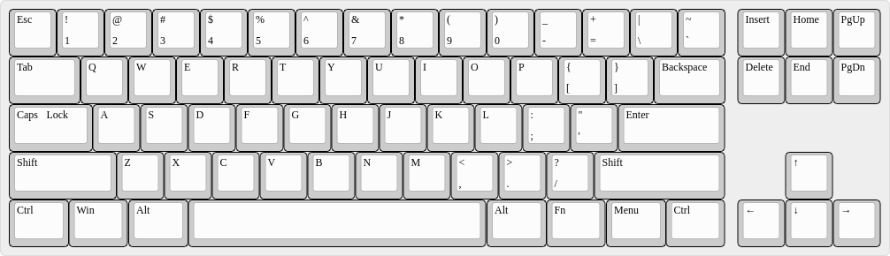
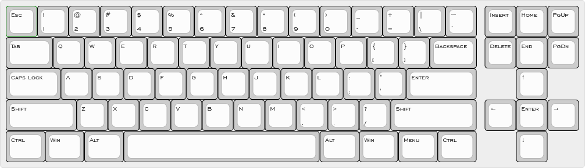
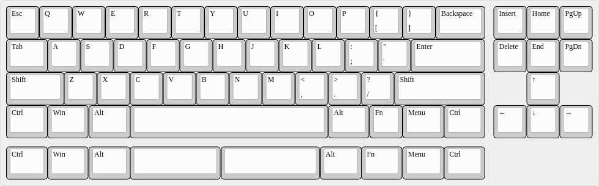
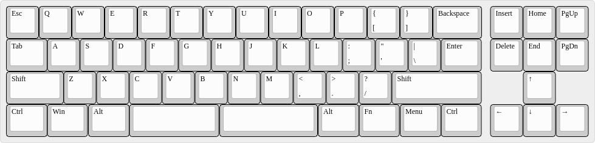
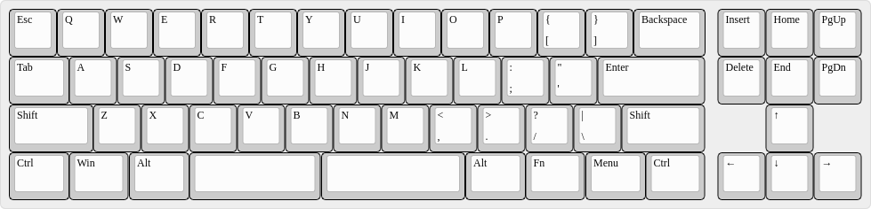
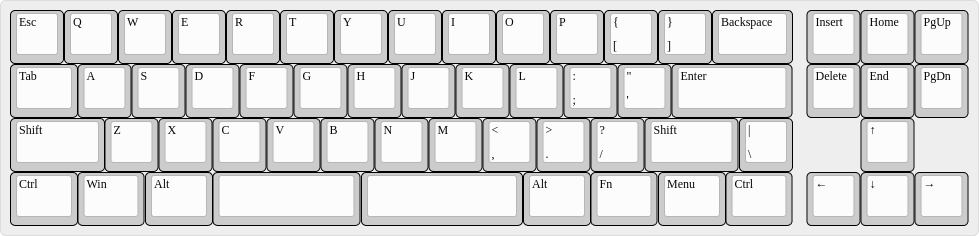
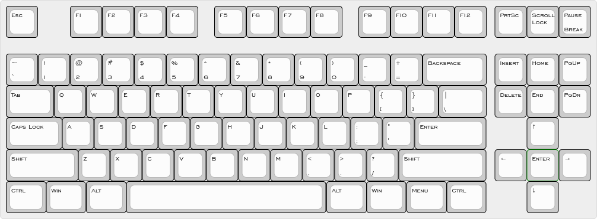

TKL Layout Designs with "missing" Rows or IBM-style cursor cross
================================================================

I'm a fan of small keyboard layouts as well as of TKL. When I first
saw a keyboard which looked like a TKL but had the whole F-row
(including Print-Screen, Scroll-Lock and Pause/Break keys) missing, I
was sold: I want such a keyboard. :-)

So far I only know two keyboard models with such a layout:

* [Drevo Calibur](https://www.drevo.net/product/keyboard/calibur) (aka
  [Keycool
  KC71](https://drop.com/buy/kc71-rgb-bluetooth-mechanical-keyboard?mode=guest_open))
  with Bluetooth
* KPRepublic 71-Keys Custom Keyboard (no more available and product
  page deleted) <!-- was https://kprepublic.com/products/custom-mechanical-keyboard-kit-71-keys-kinds-of-led-effects-pcb-70-keycool-gaming-keyboard-led-backlight-available -->

Keyboards with similar layouts:

* [Mechagodzilla](https://www.etsy.com/listing/787326873/mechagodzilla-mechanical-keyboard-case)
  (moves ScrollLock, PrintScreen and Pause/Break to row 3 directly
  above the cursor keys—nice idea—but also removes the Right Alt and
  the Meny key—bad idea)

Since I neither want Bluetooth (or any other radio technology) in any
of my keyboards, I seem to need to build such a keyboard on my own.

The Designs
-----------

(The JSON layout files are meant for usage with the [Keyboard Layout
Editor](http://www.keyboard-layout-editor.com/) and compatible tools.)

### XTKL 72

<a name="xtkl-71"><small>(Formerly named XTKL 71 as most keyboards
with such a design had 71 keys.)</small></a>

More or less the generic ANSI TKL layout with the top-most key row
removed and a bit of HHKB/Sun style.

[layout in JSON format](Layouts/XTKL-72.json)

#### XTKL 73i

Same as the XTKL 72, but with IBM-style, symmetrically arranged cursor
keys and an additional Enter key in the middle.

Due to the unusual row for left and right arrow keys, this layout is
likely only suitable for non-sculpted key cap profiles like DSA, XDA,
KAM or VSA.

[layout in JSON format](Layouts/XTKL-73i.json)

### XTKL 57

More or less the generic ANSI TKL layout, but

* with the two top-most key rows removed in the main alpha-numeric
  block, and
* the top-most row in the MF-II block removed, too.
* The second and third top-most rows of the MF-II block are moved one
  row toward the bottom.
* Left-most column key widths like a 40% keyboard and some bottom row
  optimizations with a 6u spacebar.
  
You could also describe it as 40% or 50% keyboard with all columns of
a TKL keyboard.

For keycap compatibility reasons, the width of the
Backspace/Enter/RShift column has been left untouched.

[layout in JSON format](Layouts/XTKL-57.json)

### XTKL 59

Based on the XTKL 57, it has been modified to sport a split spacebar
(3u + 2.75u) and fitted in a Pipe/Backslash key. I'm though still
unsure where, hence there are two variants currently:

#### XTKL 59a

Pipe/Backslash key close to its original position, but requires a
rather unusual 1.25u Enter key.

[layout in JSON format](Layouts/XTKL-59a.json)

#### XTKL 59b

The 1.75u Shift key is much more common as many keyboards have an
additional Fn key right of the right Shift key. Also the needed
Pipe/Backslash R4 key is common on ISO layouts. (On ISO layouts this
is on the left end of R4 on these layouts — impossible here due to the
by 0.5u reduced column width on the left side.)

[layout in JSON format](Layouts/XTKL-59b.json)

#### XTKL 59c

Same as XTKL 59b but with positions of Pipe/Backslash and Right Shift
key exchanged to that the Pipe/Backslash key is where the HHKB has
typically its Fn key: On the very right end of R4.

There's a chance that the layouts XTKL 59b and 59c and maybe even 59a
can be implemented in a single PCB, albeit maybe not a hotswap one.

[layout in JSON format](Layouts/XTKL-59c.json)

### XTKL 88i

A simple TKL layout (i.e. with the F-row still there) with just the
IBM-style, symmetrically arranged cursor keys and an additional Enter
key in the middle of them.

Due to the unusual row for left and right arrow keys, this layout is
likely only suitable for non-sculpted key cap profiles like DSA, XDA,
KAM or VSA.

[layout in JSON format](Layouts/XTKL-88i.json)
