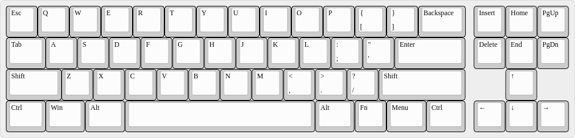

TKLs with "missing" Rows
========================

I'm a fan of small keyboard layouts as well as of TKL. When I first
saw a keyboard which looked like a TKL but was the whole F-row
(including Print-Screen, Scroll-Lock and Pause/Break keys) missing, I
was sold: I want such a keyboard. :-)

So far I only know two keyboard models with such a layout:

* [Drevo Calibur](https://www.drevo.net/product/keyboard/calibur) (aka
  [Keycool
  KC71](https://drop.com/buy/kc71-rgb-bluetooth-mechanical-keyboard?mode=guest_open))
  with Bluetooth
* KPRepublic 71-Keys Custom Keyboard (no more available and product
  page deleted)

<!-- was https://kprepublic.com/products/custom-mechanical-keyboard-kit-71-keys-kinds-of-led-effects-pcb-70-keycool-gaming-keyboard-led-backlight-available -->

Since I neither want Bluetooth (or any other radio technology) in any
of my keyboards, I seem to need to build such a keyboard on my own.

The Designs
-----------

(The JSON layout files are meant for usage with the [Keyboard Layout
Editor](http://www.keyboard-layout-editor.com/) and compatible tools.)

### XTKL 71

More or less the generic ANSI TKL layout with the top-most key row
removed and a bit of HHKB/Sun style.

[layout in JSON format](Layouts/XTKL-71.json)

### XTKL 57

More or less the generic ANSI TKL layout, but

* with the two top-most key rows removed in the main alpha-numeric
  block, and
* the top-most row in the MF-II block removed, too.
* The second and third top-most rows of the MF-II block are moved one
  row toward the bottom.
* Left-most column key widths like a 40% keyboard and some bottom row
  optimizations, probably allowing a split spacebar (3u + 2.75u) and
  single spacebar (6u) design.
  
You could also describe it as 40% or 50% keyboard with all columns of
a TKL keyboard.

For keycap compatibility reasons, the width of the
Backspace/Enter/RShift column has been left untouched.

[layout in JSON format](Layouts/XTKL-57.json)

