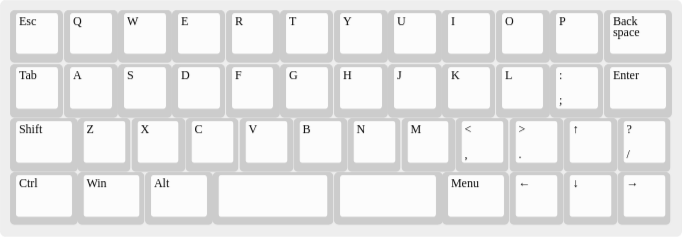

Minimal Kinda-Staggered 40% Keyboard Layout Design
==================================================

At some point I noticed at least most of my 40% keyboards have more
less the same layout (probably because I like 40% keyboards with
cursor clusters), but that they differ in the overall width:

* [Planck](https://olkb.com/planck) (4x12 ortholinear, no stagger; I
  do have its bigger brother, the 5x12
  [Preonic](https://olkb.com/preonic)): 12u
* [Zlant](https://www.1upkeyboards.com/shop/keyboard-kits/diy-40-kits/zlant-40-keyboard-kit/):
  12.75u (over all width; per-row width is 12u like a Planck)
* [UT47.2](https://keyhive.xyz/shop/ut472-group-buy): 12.5u
* [MiniVan](https://thekey.company/collections/upcoming-releases/products/minivan):
  12.75u
* [BM43a](https://kprepublic.com/products/bm43a-aluminium-high-sloped-case):
  12u
* [Daisy](https://kprepublic.com/collections/daisy-41): 12u

Comparing them shows where they reduce width:

* The MiniVan is closest to standard ANSI layout, especially with
  regards to row offsets.

* The UT47.2 is — except for the bottom row — very similar to the
  MiniVan. It reduces the overall width by 0.25u by reducing the
  offset between the ASDF and ZXCV row from standard 0.5u to 0.25u,
  i.e. having the same stagger offset between all three rows with
  alphabetic characters. Accordingly Backspace and Enter are shrunk by
  0.25u to make all rows the same width again.
  
* The Zlant is — except for the bottom row — very similar to the
  UT47.2. Only that the edge keys are all 1u and hence the offsets are
  also present on the edges.

* The BM43a is kinda the exception: It mostly looses width by having
  removed one more column, the one with the `;:` and `.>` keys, and
  then shrinking Backspace to 1u. Since this is only a difference of
  0.75u to the MiniVans width, but it has the cursor cluster at 1u key
  cap widths at right end, it had to extend the offset between the
  ASDF and the ZXCV rows by 0.25u to 0.75u — which makes it look a bit
  awkward and scares off some users.

* The Daisy does the same as the BM43a, just without that awkward
  non-standard offset. It uses an 1.25u arrow right (and left) key
  instead.

And then there is the [Alpha28](https://github.com/PyrooL/Alpha), a
semi-ortholinear, semi-staggered sub-30% keyboard which has no offset
between the QWERT and the ASDF rows (like an ortholinear keyboard) and
0.5u offset between the ASDF and the ZXCV rows (like a standard
staggered keyboard).

I found this kind of stagger reduction quite comfortable to type on.

The Design
----------

So I basically took the UT47.2 design, shifted the top row 0.25u to
the right to reduce the stagger to the next row to zero. Then I
reduced the leftmost keys in the two middle rows by 0.25u, too, to
align the left edges again. In the end I took the bottom row of the
MiniVan and used 4× 1.25u modifier keys (i.e. even standard sizes!)
instead of 4× 1u and 1× 1.5u keys to spare 0.5u of overall bottom row
width compared to the MiniVan.

So I end up with a 12.25u overall width of a keyboard which is very
similar to the UT47.2 and MiniVan while still reducing the overall
width by 0.25 respectively 0.5u — and only being 0.25u away from the
12u BM43a while having two more keys and an IMHO much more comfortable
non-standard stagger.

### XTM 45

[layout in JSON format](Layouts/XTM-45.json)

(The JSON layout files are meant for usage with the [Keyboard Layout
Editor](http://www.keyboard-layout-editor.com/) and compatible tools.)
