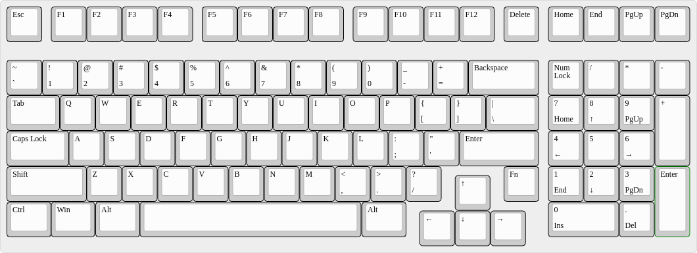

A Sperno59 Derivative in 1800 Style
===================================

Via the [Swiss Mechanical Keyboard Enthusiast's Telegram
Chat](https://t.me/swissmk) I recently stumbled upon the [Sperno59
keyboard](https://geekhack.org/index.php?topic=116529.0) on
Geekhack. It's a keyboard without most right modifier keys and a
cursor block instead.

I quickly wondered two things about its creative layout:

* Shouldn't there be a Fn key right of the Up key instead of a
  blocker? (I hate right-side blockers on R4.)
  
* What about an [1800 style
  layout](https://www.cherry.de/cherry-g80-1800.html) with the
  Sperno59's layout as main block.

The result can be seen here.

The Design
-----------

### XTerno1800

[layout as JSON file for the KLE](Layouts/xterno1800.json)
